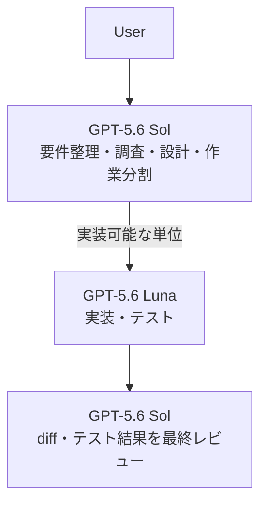
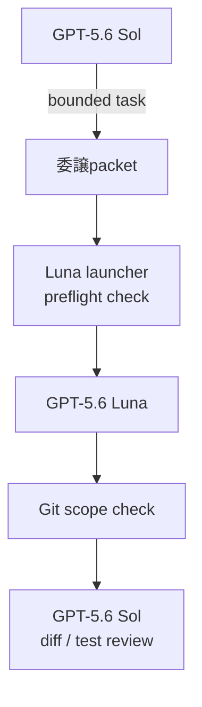
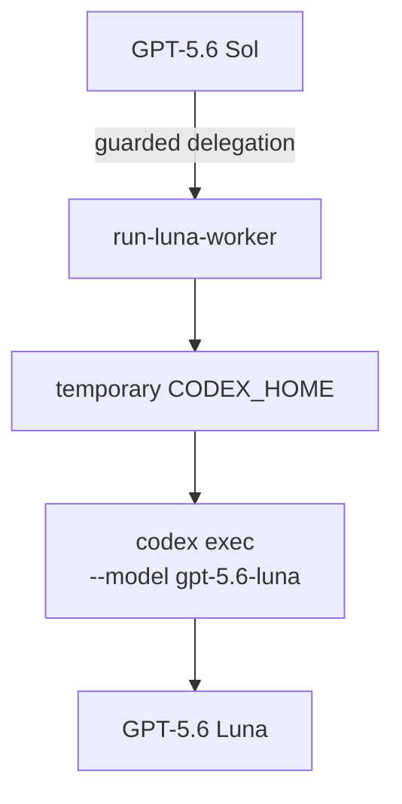

# codex-exosphere

**GPT-5.6 Solの判断力を活かしながら、実装をより低コストなGPT-5.6 Lunaへ任せるためのCodex CLI向け開発ハーネスです。**

Solは要件整理・設計・作業分割・最終レビューに集中し、仕様と変更範囲が固まった実装をLunaへ委譲します。Lunaの変更はGitで検査され、最終的にはSolが実際のdiffとテスト結果を確認します。

さらに、問題整理・デバッグ・TDD・設計分析・レビュー・検証などの開発Skillを同梱。
単にモデルを振り分けるだけでなく、**SolとLunaそれぞれの作業品質を底上げする開発環境**を目指しています。

[English](README_en.md)

---

## 何がうれしいのか

### 1. 低コストなLunaを実装workerとして使える

GPT-5.6 Solは強力ですが、すべてのコーディングをSol自身に行わせる必要はありません。

codex-exosphereでは、Solが問題を理解して作業を整理したあと、判断の余地が少ない実装単位をGPT-5.6 Lunaへ委譲できます。現在のCodex価格体系ではLunaはSolより低コストです（[Codex rate card](https://help.openai.com/en/articles/20001106-codex-rate-card)）。



ユーザーがLunaを直接操作する必要はありません。
通常どおりSolへ作業を依頼すれば、委譲するかどうかも含めてSolが判断します。

### 2. Sol / Lunaの開発作業そのものを改善する

codex-exosphereには、ソフトウェア開発向けのSkillセットが含まれています。

たとえば、

* 問題が曖昧なら、いきなり実装せず整理する（`problem-framing`）
* 原因不明の不具合なら、推測で修正せず証拠から原因を絞る（`systematic-diagnosis`）
* 明確な局所変更なら、focused testを使って実装する（`bounded-tdd`）
* 「できました」という自己申告ではなく、実際のdiffとfreshな検証結果を見る（`verification-before-reporting`）

といった開発パターンをCodexに与えます。全10種類の一覧は[Engineering Skills](#engineering-skills)にあります。

Skillはタスクに応じて暗黙的に選択されるため、通常はユーザーがSkill名を指定する必要はありません。

### 3. Lunaへ任せても野放しにしない

Lunaは単なる別プロセスとして自由に実装するわけではありません。

Solが委譲する作業には、何を実装するか、何をもって完了とするか、変更してよい範囲、変更してはいけないもの、必要な検証、判断が必要になったら止まる条件が与えられます。

さらにworker実行の前後でGitの状態を比較し、指定外の変更やcommitなどを検出します。

Luna自身が「成功した」と報告しても、それだけでは完了になりません。

**実際のdiffと検証結果をSolが確認してから、ユーザーへ最終結果を報告します。**

---

## Quick Start

### Requirements

主な対象環境はLinuxです。

必要なもの:

* Python 3.10+
* Bash
* Git
* Codex CLI
* Codex CLIを利用できる認証環境

追加のPythonパッケージは必要ありません。

### Install

```bash
git clone https://github.com/whitedoll99/codex-exosphere.git ~/codex-exosphere
cd ~/codex-exosphere
```

まず、何がインストールされるか確認します。

```bash
python3 bootstrap/install.py
```

この段階では変更は行われません。

問題がなければ適用します。

```bash
python3 bootstrap/install.py --apply
```

最後に検証します。

```bash
python3 bootstrap/verify.py
```

これで基本的なセットアップは完了です。

インストールは`$CODEX_HOME`、`$HOME/.local/bin`、`$HOME/plugins`配下へファイルを書き込みます。正確な対応は[Managed paths](docs/managed-paths.md)を参照してください。

既存の`$CODEX_HOME/AGENTS.md`は上書きも自動mergeもされません。planが`CONFLICT`を表示した場合は`--apply`へ進まず、[既存Codex環境への導入](docs/install-existing-environment.md)に従ってください。

### Use

作業したいGitリポジトリで、普通にCodexを起動します。

```bash
cd /path/to/your-project
codex
```

あとは普段どおり依頼してください。

```text
設定画面で保存ボタンを押しても変更が反映されません。
原因を調べて修正し、関連するテストも実行してください。
```

ユーザーが、

* Lunaを起動する
* 委譲packetを書く
* Skillを選ぶ
* launcherを直接操作する

必要は通常ありません。

Solがタスクを整理し、必要に応じてSkillを使い、Lunaへ委譲できる作業かどうかを判断します。

---

## How it works

codex-exosphereでは、モデルを単純な上下関係ではなく、役割によって使い分けます。

| Model             | Role                      |
| ----------------- | ------------------------- |
| **GPT-5.6 Sol**   | 問題理解、調査、設計、作業分割、判断、最終レビュー |
| **GPT-5.6 Luna**  | 仕様と範囲が明確になった実装            |
| **GPT-5.6 Terra** | 必要に応じたread-heavyな追加レビュー   |

基本的な考え方はシンプルです。

> **Use Sol for judgment.
> Use Luna for implementation.
> Let Sol verify the result.**

### Solが担当する仕事

たとえば次のような仕事はSolが保持します。

* 要求がまだ曖昧
* 原因不明の障害調査
* アーキテクチャ判断
* public API / CLIの設計
* schemaやmigration
* 互換性判断
* security / privacyに関わる変更
* 複数componentにまたがる大きな作業

### Lunaへ渡す仕事

Lunaに適しているのは、たとえば次のような作業です。

* 再現済みの局所バグ修正
* 既存パターンに沿った実装
* focused testで確認できる変更
* 変更範囲を明確に限定できる作業

途中で設計判断やscope拡張が必要になった場合、Lunaは勝手に決めずSolへ戻します。

### 委譲の流れ



packetの仕様、preflight / postflightの検査内容、手動でpacketを扱う方法は[Luna delegation contract](docs/luna-delegation-contract.md)にあります。

### 権限について

model routingは権限を与えません。commit、push、release、deploymentなどの外部影響を伴う変更には、通常どおり別の認可が必要です。詳細は[Responsibility boundaries](docs/responsibility-boundaries.md)を参照してください。

---

## Why an external Luna worker?

2026-08-08時点のCodexでは、LunaはMulti-Agent V1として登録されており、V2のnative subagentとして直接spawnできません（[openai/codex#34700](https://github.com/openai/codex/issues/34700)）。

codex-exosphereはこの制約のもとで、Lunaを独立したephemeral Codex processとして実行し、Sol側の管理下へ組み込みます。これは製品の本質ではなく、現時点でこの実装方式を採っている理由です。

概念的には次のようになります。



ただし、単に別のCodex CLIを起動しているだけではありません。

Luna用の環境には、

* 必要な実装Skillだけをロード
* task scopeを明示
* Git状態を事前確認
* 変更可能範囲を検査
* 実行結果をSolへ返却

する仕組みが追加されています。

---

## Engineering Skills

Skillは単なるプロンプト例ではなく、Codexが特定の種類の問題に遭遇したときに使う開発workflowです。

### Included Skills

| Skill                           | 主な用途             |
| ------------------------------- | ---------------- |
| `problem-framing`               | 曖昧な要求を実装可能な問題へ整理 |
| `systematic-diagnosis`          | 不具合を証拠ベースで診断     |
| `bounded-tdd`                   | 明確な局所変更をTDDで実装   |
| `contract-design`               | API・CLIなどの契約設計   |
| `architecture-quality-analysis` | アーキテクチャ案の比較      |
| `domain-model-audit`            | ドメインモデルの検査       |
| `interface-boundary-audit`      | インターフェース境界の検査    |
| `review-feedback-triage`        | レビュー指摘の妥当性確認     |
| `review-packet-preparation`     | 独立レビュー用の情報整理     |
| `verification-before-reporting` | 完了報告前の最終検証       |

Solは状況に応じてこれらを使います。
Lunaにはこのうち実装に必要なSkillだけを与え、設計や最終判断はSol側に残します。

### 動き方の例

原因不明の障害では `systematic-diagnosis` が、

```text
症状
 ↓
最小再現
 ↓
境界ごとの証拠確認
 ↓
仮説
 ↓
反証可能な検査
 ↓
root cause
```

という流れを促します。

明確な実装では `bounded-tdd` が、

```text
failing test
    ↓
minimum implementation
    ↓
passing test
    ↓
broader verification
```

という作業を促します。

完了時には `verification-before-reporting` が、古いテスト結果やworkerの自己申告ではなく、現在のdiffとfreshな検証証拠を確認します。

Skill routing自体もevaluation harnessで検証できます。設計は[Skill routing eval design](docs/skill-routing-eval-design.md)、初回baselineは[2026-07-16 baseline](docs/skill-routing-eval-baseline-2026-07-16.md)にあります。

---

## Optional Terra review

GPT-5.6 Terraは、通常の変更で毎回使うものではありません。

大きなdiff、regression scan、多数のファイルを読む必要があるレビューなどで、追加のreviewerとして利用できます。

Terraはread-only sandboxで動作するよう設定されており、workspaceを変更しないよう指示されています。ただしruntime側の設定がこれを上回る場合があるため、この境界が重要な場面では[Responsibility boundaries](docs/responsibility-boundaries.md)を確認してください。

Terraの意見も最終決定ではありません。

Solが指摘内容を実際のrepository evidenceと照合し、採否を判断します。

---

## Observatory

Codex Observatoryは、codex-exosphereの実行状況を確認するための軽量なobservability機能です。

タスク、委譲、レビュー、Skill利用、usageなどの運用イベントを確認できます。

一方で、

* prompt
* source code
* diff
* credential

などの内容そのものは保存しません。

```bash
codex-observe summary
codex-observe tasks --limit 20
codex-observe serve
```

詳細は[Observability foundation design](docs/observability-foundation-design.md)を参照してください。

---

## Evaluation

モデルやSkillのルーティングが「設定上そうなっている」だけではなく、実際に期待どおり動くか確認するためのeval harnessを含んでいます。

通常の確認ではモデルを呼びません。

```bash
python3 evals/run.py list
python3 evals/run.py validate
python3 evals/run.py plan --case routing-local-bug
```

明示的にlive evaluationを実行することもできます。

```bash
python3 evals/run.py live \
  --case routing-local-bug \
  --output /tmp/codex-eval-routing-local-bug
```

routing、Skill選択、Lunaのscope判断、Solのdiff reviewなどを観測できます。

---

## Verify / Uninstall

インストール状態の確認:

```bash
python3 bootstrap/verify.py
```

uninstall plan:

```bash
python3 bootstrap/uninstall.py
```

実際に削除:

```bash
python3 bootstrap/uninstall.py --apply
```

installer管理外のファイルを無条件に削除することはありません。

---

## Documentation

READMEでは通常利用に必要な概要だけを扱います。

内部contract、設計判断、評価方法、実測結果などは `docs/` にあります。

* [Luna delegation contract](docs/luna-delegation-contract.md) — 委譲packet、Git scope guard、手動操作
* [Luna worker efficiency design](docs/luna-worker-efficiency-design.md) — Luna work-unitとcontext効率
* [Skill routing eval design](docs/skill-routing-eval-design.md) — Skill / model routing評価
* [Observability foundation design](docs/observability-foundation-design.md) — Observatory設計
* [Managed paths](docs/managed-paths.md) — installerが書き込む先の一覧
* [既存Codex環境への導入](docs/install-existing-environment.md) — `CONFLICT`の扱い
* [Responsibility boundaries](docs/responsibility-boundaries.md) — 責任境界、権限、sandboxの実効範囲
* [Verified scope and limitations](docs/verified-scope.md) — 検証済み範囲と未検証事項

---

## Repository layout

```text
agents/                 Luna / Terra agent definitions
bin/                    Luna launcher and command shims
bootstrap/              install / verify / uninstall
codex_observability/    Observatory
config/                 Codex configuration
docs/                   contracts, designs and baselines
evals/                  Skill / model routing evaluation
plugins/                engineering Skills
tests/                  tests
```

---

## Current status

codex-exosphereは現在、**個人のLinux開発環境**を主な対象としています。

bootstrap、install、verification、uninstallの各経路は、隔離したLinux環境でend to endに検証済みです。一方で、**公開版を新規インストールした直後の、認証を伴うSol / Luna / Terraの実model実行はまだ検証していません。**

macOS / Windowsは現時点では主要な検証対象ではありません。Codex CLIやモデル側の仕様変更によって挙動が変わる可能性があります。

検証済み範囲と未検証事項の詳細は[Verified scope and limitations](docs/verified-scope.md)にあります。

---

## License

MIT License
