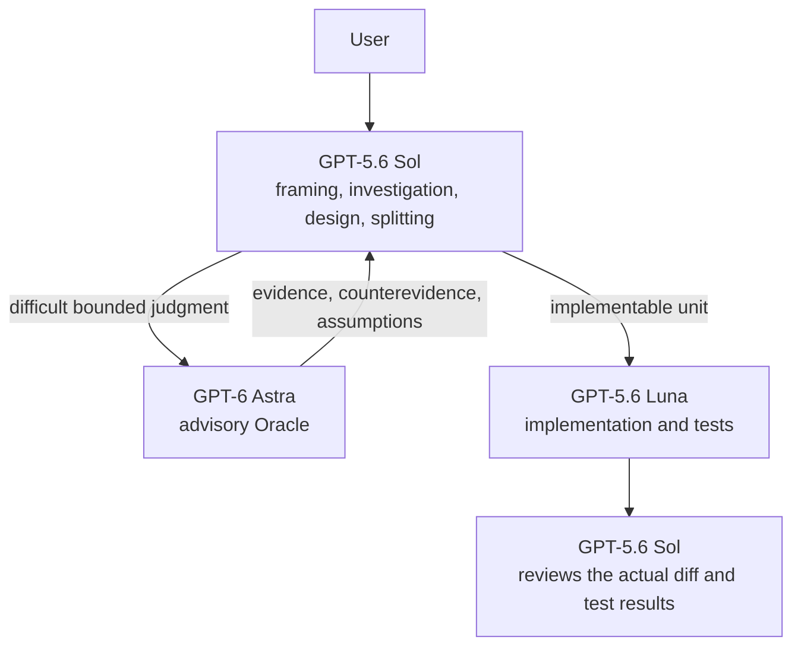
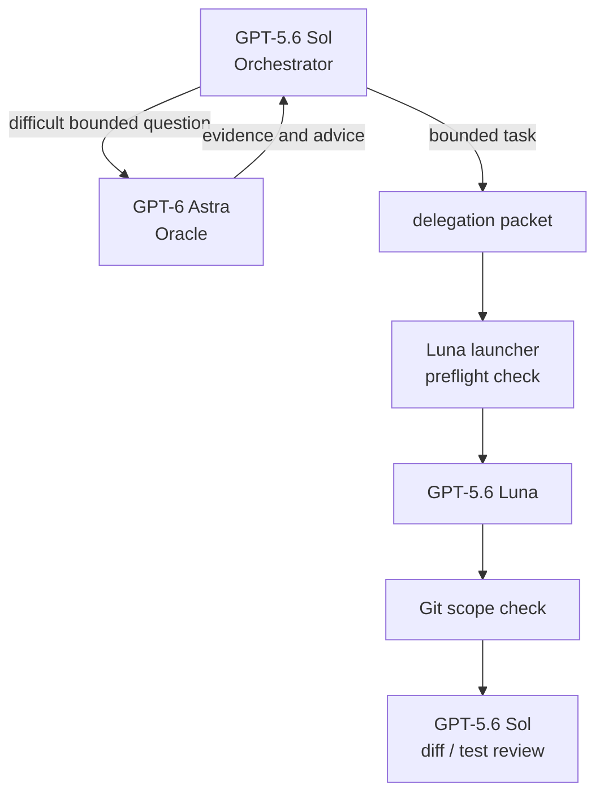
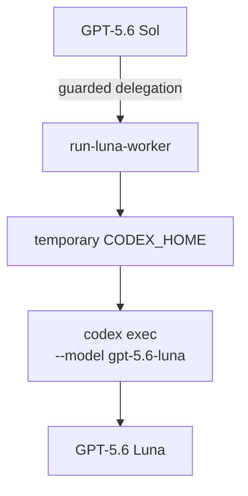

# codex-exosphere

**A Codex CLI development harness that uses Sol as Orchestrator, Astra as Oracle, and Luna as Worker.**

Sol owns normal conversation, investigation, judgment, and final review. Difficult framing and conflicting causal explanations go to Astra Oracle as bounded advisory questions, with no mutation authority. Once behavior and change boundaries are settled, implementation goes to Luna. Sol verifies both Oracle advice and Luna's changes against primary evidence. Astra's agent definition requests a `read-only` sandbox, but a parent runtime override may take precedence, so this is not a guaranteed mechanical write barrier. Regardless of effective runtime permissions, Oracle is not authorized to modify files, commit, push, publish, or perform other mutations.

The harness also ships development Skills for problem framing, diagnosis, TDD, design analysis, review, and verification. It is not only model routing: the goal is **a development environment that raises the quality of judgment, advice, and implementation**.

[日本語](README.md)

---

## Why you would want this

### 1. Use the lower-cost Luna as your implementation worker

GPT-5.6 Sol is capable, but there is no need to make Sol write every line.

In codex-exosphere, Sol understands the problem and organizes the work, then delegates implementation units that need little judgment to GPT-5.6 Luna. Under the current Codex pricing, Luna costs less than Sol ([Codex rate card](https://help.openai.com/en/articles/20001106-codex-rate-card)).



You do not drive Astra or Luna yourself. Ask Sol for the work as usual, and Sol decides whether to consult or delegate at all.

### 2. Improve how each role actually works

codex-exosphere includes a set of Skills for software development.

For example:

* If the request is still vague, organize it before implementing (`problem-framing`)
* If the cause is unknown, narrow it from evidence instead of guessing at a fix (`systematic-diagnosis`)
* If the change is clear and local, implement it against a focused test (`bounded-tdd`)
* Look at the actual diff and fresh verification, not at a "done" self-report (`verification-before-reporting`)

All ten Skills are listed under [Engineering Skills](#engineering-skills).

Skills are selected implicitly for the task, so you normally do not name one.

### 3. Delegating to Luna does not mean letting it run loose

Luna is not a separate process free to change whatever it likes.

Each delegated task carries what to implement, what counts as done, which paths may change, what must not change, the verification to run, and the conditions under which Luna must stop and hand the decision back.

The launcher also compares Git state before and after the run, so changes outside the declared scope, or a commit, are detected.

Luna reporting success is not completion.

**Sol confirms the actual diff and the verification result before reporting anything back to you.**

---

## Quick Start

### Requirements

Linux is the primary target.

You need:

* Python 3.10+
* Bash
* Git
* Codex CLI
* A working Codex authentication

No third-party Python packages are required.

### Install

```bash
git clone https://github.com/whitedoll99/codex-exosphere.git ~/codex-exosphere
cd ~/codex-exosphere
```

First, see what would be installed.

```bash
python3 bootstrap/install.py
```

This phase changes nothing.

If the plan looks right, apply it.

```bash
python3 bootstrap/install.py --apply
```

Then verify.

```bash
python3 bootstrap/verify.py
```

That completes the basic setup.

Installation writes files under `$CODEX_HOME`, `$HOME/.local/bin`, and `$HOME/plugins`. See [Managed paths](docs/managed-paths.md) for the exact mapping.

An existing `$CODEX_HOME/AGENTS.md` is never overwritten or auto-merged. If the plan reports `CONFLICT`, do not proceed to `--apply`; follow [Install into an existing Codex environment](docs/install-existing-environment.md).

### Use

Start Codex normally, inside the Git repository you want to work in.

```bash
cd /path/to/your-project
codex
```

Then ask for the work the way you normally would.

```text
Saving on the settings screen does not apply the change.
Find the cause, fix it, and run the related tests.
```

You normally do not need to:

* start Luna
* write a delegation packet
* choose a Skill
* drive the launcher directly

Sol organizes the task, uses Skills where they apply, and decides whether the work is eligible for delegation.

---

## How it works

codex-exosphere separates models by role rather than by rank.

| Model | Role |
| ----- | ---- |
| **GPT-5.6 Sol** | Orchestrator: framing, investigation, design, delegation, judgment, and final review |
| **GPT-6 Astra** | Oracle: non-mutating advice on difficult framing, conflicting causal explanations, and decisions coupling multiple contracts |
| **GPT-5.6 Luna** | Worker: implementation once behavior and boundaries are settled |

The idea is simple.

> **Use Sol for judgment.**<br>
> **Use Astra for bounded advice.**<br>
> **Use Luna for implementation.**<br>
> **Let Sol verify the result.**

### Work Sol keeps

Sol holds work such as:

* requests that are still underspecified
* failures whose cause is not yet isolated
* architecture decisions
* public API and CLI design
* schema and migration
* compatibility judgment
* security and privacy changes
* large work spanning multiple components

### When Sol consults Astra

Sol gives Astra Oracle one bounded question only when the problem framing itself remains suspect after inspecting evidence, causal explanations still conflict, or a design decision coupling multiple contracts cannot be resolved locally.

Oracle returns evidence, counterevidence, assumptions, and the smallest next check. It does not implement, approve, commit, or push. `sandbox_mode = "read-only"` is an agent-side request; a parent runtime override may supersede it. Treat read-only as the Oracle's operating contract, not as a mechanically guaranteed write barrier unless the effective runtime boundary has been confirmed. Missing facts call for investigation first, while user preferences and authority remain with their owners.

### Work Luna receives

Luna suits work such as:

* a reproduced, local defect fix
* implementation that follows an existing pattern
* changes confirmable by a focused test
* work whose change boundary can be stated exactly

If a design decision or a scope extension turns out to be necessary mid-task, Luna returns it to Sol instead of deciding on its own.

### The delegation cycle



The packet schema, the preflight and postflight checks, and the manual interface are documented in the [Luna delegation contract](docs/luna-delegation-contract.md).

### Authority

Model routing grants no authority. Commit, push, release, deployment, and other external changes still require their normal authorization. See [Responsibility boundaries](docs/responsibility-boundaries.md).

---

## Why an external Luna worker?

As of 2026-08-08, Luna is registered as Multi-Agent V1 in Codex and cannot be spawned directly as a V2 native subagent ([openai/codex#34700](https://github.com/openai/codex/issues/34700)).

Given that constraint, codex-exosphere runs Luna as an independent ephemeral Codex process placed under Sol's control. This is not the point of the product; it is the reason for the current implementation approach.

Conceptually:



It is not merely another Codex CLI invocation. The Luna environment additionally:

* loads only the Skills needed for implementation
* states the task scope explicitly
* records Git state beforehand
* checks the changed paths afterwards
* returns a bounded result to Sol

---

## Engineering Skills

Skills are not prompt samples. They are development workflows Codex uses when it meets a particular kind of problem.

### Included Skills

| Skill                           | Purpose                                            |
| ------------------------------- | -------------------------------------------------- |
| `problem-framing`               | Turn a vague request into an implementable problem  |
| `systematic-diagnosis`          | Diagnose a defect from evidence                     |
| `bounded-tdd`                   | Implement a clear local change test-first           |
| `contract-design`               | Design API and CLI contracts                        |
| `architecture-quality-analysis` | Compare architecture options                        |
| `domain-model-audit`            | Audit the domain model                              |
| `interface-boundary-audit`      | Audit interface boundaries                          |
| `review-feedback-triage`        | Check whether review findings hold                  |
| `review-packet-preparation`     | Prepare material for independent review             |
| `verification-before-reporting` | Verify before reporting completion                  |

Sol uses these as the situation calls for them.
Luna receives only the implementation Skills; design and final judgment stay with Sol.

### How a Skill shapes the work

For an unexplained failure, `systematic-diagnosis` drives:

```text
symptom
 ↓
minimal reproduction
 ↓
evidence at each boundary
 ↓
hypothesis
 ↓
falsifiable check
 ↓
root cause
```

For a clear implementation, `bounded-tdd` drives:

```text
failing test
    ↓
minimum implementation
    ↓
passing test
    ↓
broader verification
```

At completion, `verification-before-reporting` looks at the current diff and fresh evidence rather than stale test output or a worker's self-report.

Skill routing itself can be evaluated. See the [Skill routing eval design](docs/skill-routing-eval-design.md) and the [2026-07-16 baseline](docs/skill-routing-eval-baseline-2026-07-16.md).

---

## Observatory

Codex Observatory is a lightweight local view of what codex-exosphere did.

It records operational events such as tasks, delegations, reviews, Skill use, and usage.

It does not store the content itself:

* prompts
* source code
* diffs
* credentials

```bash
codex-observe summary
codex-observe tasks --limit 20
codex-observe serve
```

See the [Observability foundation design](docs/observability-foundation-design.md).

---

## Evaluation

The harness includes an eval harness so that model and Skill routing can be checked against actual behavior, not only against configuration.

The ordinary commands call no model.

```bash
python3 evals/run.py list
python3 evals/run.py validate
python3 evals/run.py plan --case routing-local-bug
```

A live evaluation is explicit.

```bash
python3 evals/run.py live \
  --case routing-local-bug \
  --output /tmp/codex-eval-routing-local-bug
```

This observes routing, Skill selection, Luna's scope judgment, and Sol's diff review.

---

## Verify / Uninstall

Check the installed state:

```bash
python3 bootstrap/verify.py
```

Uninstall plan:

```bash
python3 bootstrap/uninstall.py
```

Apply the removal:

```bash
python3 bootstrap/uninstall.py --apply
```

Files the installer does not own are never removed unconditionally.

---

## Documentation

The README covers what you need for ordinary use. Internal contracts, design decisions, evaluation methods, and measured results live in `docs/`.

Documents under `docs/` are currently maintained primarily in Japanese; this English README covers installation and the supported first-use path.

* [Luna delegation contract](docs/luna-delegation-contract.md) — delegation packet, Git scope guard, manual interface
* [Luna worker efficiency design](docs/luna-worker-efficiency-design.md) — Luna work units and context efficiency
* [Skill routing eval design](docs/skill-routing-eval-design.md) — Skill and model routing evaluation
* [Observability foundation design](docs/observability-foundation-design.md) — Observatory design
* [Managed paths](docs/managed-paths.md) — exactly what installation writes
* [Install into an existing Codex environment](docs/install-existing-environment.md) — handling `CONFLICT`
* [Responsibility boundaries](docs/responsibility-boundaries.md) — ownership, authority, and effective sandboxing
* [Verified scope and limitations](docs/verified-scope.md) — what is verified and what is not

---

## Repository layout

```text
agents/                 Astra Oracle / Luna Worker agent definitions
bin/                    Luna launcher and command shims
bootstrap/              install / verify / uninstall
codex_observability/    Observatory
config/                 Codex configuration
docs/                   contracts, designs and baselines
evals/                  Skill / model routing evaluation
plugins/                engineering Skills
tests/                  tests
```

---

## Current status

codex-exosphere currently targets a **personal Linux development environment**.

The bootstrap, install, verification, and uninstall paths have been exercised end to end in an isolated Linux environment. However, **a fresh authenticated model run by Sol, Astra, or Luna immediately after installing the public release has not been verified yet.**

macOS and Windows are not primary verification targets at this point, and behavior may change with Codex CLI or model-side updates.

Details of what is verified and what is not are in [Verified scope and limitations](docs/verified-scope.md).

---

## License

MIT License
